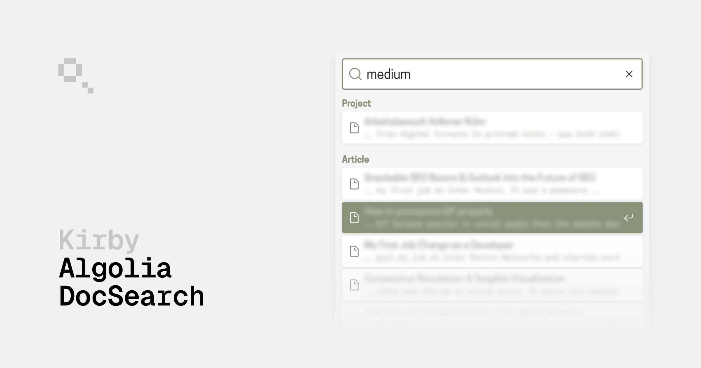

# Kirby Algolia DocSearch

Quickest way to integrate a search bar in your Kirby project. Index your content with a Kirby CLI command or Panel button push it to Algolia. The [Algolia's DocSearch](https://docsearch.algolia.com) JavaScript library will display a search button and result modal for you.

You can use the **Algolia free plan**, since the plugin itself indexes and parses the site. The Algolia crawler (a paid feature) is not needed. Leaving you with the option to stick with the free tier. 💸

> “But DocSearch is for documentations! My Kirby project is not a documentation!” you might add.

Well, we co-opt the DocSearch library for our own purposes. 😏 The library can be used anywhere, if the data model matches the requirements. Which it does. 🎉

## Key Features

- 🫡 No Algolia configuration required, just an account
- 🌐 Multi-language support
- 🆑 [Kirby CLI](https://github.com/getkirby/cli) command support
- 🧋 [Janitor](https://github.com/bnomei/kirby3-janitor) support

## Preview


## Requirements

- Kirby 3.9+

Kirby is not free software. However, you can try Kirby and the Starterkit on your local machine or on a test server as long as you need to make sure it is the right tool for your next project. … and when you’re convinced, [buy your license](https://getkirby.com/buy).

## Installation

### Composer

```bash
composer require johannschopplich/kirby-algolia-docsearch
```

### Download

Download and copy this repository to `/site/plugins/kirby-algolia-docsearch`.

## Setup

### Algolia Account

If you do not yet have an Algolia account, you [can create one](https://www.algolia.com/users/sign_up).

### DocSearch Library

The DocSearch library to display the search input field and result modal is not included in this package. Follow the instructions on the [Algolia DocSearch installation website](https://docsearch.algolia.com/docs/DocSearch-v3#installation) to add it to your project.

<details>

<summary>👉 <strong>tl;dr</strong> Installation</summary>

1. Import the required JS and CSS files in your project. Either by using a CDN or by installing the library via NPM.

   ```bash
   npm install @docsearch/js@3 @docsearch/css@3
   ```

   Or:

   ```html
   <link
     rel="stylesheet"
     href="https://cdn.jsdelivr.net/npm/@docsearch/css@3"
   />
   <script src="https://cdn.jsdelivr.net/npm/@docsearch/js@3"></script>
   ```

2. Create a [container](https://docsearch.algolia.com/docs/api#container) for your DocSearch component to go in.

   ```html
   <div id="docsearch"></div>
   ```

3. Initialize the DocSearch library with your Algolia credentials.

   ```ts
   docsearch({
     container: "#docsearch",
     appId: "YOUR_APP_ID",
     indexName: "YOUR_INDEX_NAME",
     apiKey: "YOUR_SEARCH_API_KEY",
   });
   ```

</details>

## Usage

### Configuration

```php
# /site/config/config.php
return [
    'johannschopplich.algolia-docsearch' => [
        // Algolia App ID for the project
        'appId' => 'ALGOLIA_APP_ID',
        // Algolia API Key for the project
        'apiKey' => 'ALGOLIA_API_KEY',
        // Algolia index base name; in mutlilang projects,
        // the language code will be appended by the plugin,
        // e.g. `example-de` for German
        'index' => 'example',
        // HTML tag name which contains a page's content or
        // closure which returns the content of a page
        // If not given defaults to `body`
        'content' => 'main',
        // Register hooks to index a page on changed slug,
        // title, content or status
        'hooks' => false,
        // Templates which should be indexed
        'templates' => [
            'article',
            'default',
            'home',
            'project'
        ],
        // Optional pages which should be excluded from the index
        'exclude' => [
            'pages' => [
                'blog/some-post',
            ]
        ],
        // Define the search hit label
        'label' => [
            // Accepts a string or an array of strings for each language
            // Single language:
            // 'default' => 'Page'
            // Multiple languages:
            'default' => [
                'de' => 'Seite',
                'en' => 'Page'
            ],
            'templates' => [
                // Accepts a string or an array of strings for each language
                // Single language:
                // 'article' => 'Article'
                // Multiple languages:
                'article' => [
                    'de' => 'Artikel',
                    'en' => 'Article'
                ],
                'project' => [
                    'de' => 'Projekt',
                    'en' => 'Project'
                ]
            ]
        ]
    ]
];
```

#### Callback for Content

Instead of extracting content by an HTML tag name, you can define a closure which returns the content of a page:

```php
# /site/config/config.php
return [
    'johannschopplich.algolia-docsearch' => [
        // Return any string which should be indexed
        'content' => fn (\Kirby\Cms\Page $page, string|null $languageCode) => strip_tags($page->text()->toBlocks()->toHtml())
        // other options …
    ]
];
```

In multi-language projects, you can also pass the language code to the closure and return the content for the given language:

```php
# /site/config/config.php
return [
    'johannschopplich.algolia-docsearch' => [
        // Return any string which should be indexed
        'content' => function (\Kirby\Cms\Page $page, string|null $languageCode) {
            return strip_tags($page->content($languageCode)->text()->toBlocks()->toHtml());
        }
        // other options …
    ]
];
```

Defining callbacks for each template is also possible:

```php
# /site/config/config.php
return [
    'johannschopplich.algolia-docsearch' => [
        // Return any string which should be indexed
        'content' => [
            'default' => fn (\Kirby\Cms\Page $page, string|null $languageCode) => strip_tags($page->text()->toBlocks()->toHtml())
            'home' => fn (\Kirby\Cms\Page $page, string|null $languageCode) => $page->description()->value()
        ]
        // other options …
    ]
];
```

### Indexing the Site

#### Kirby CLI

Run the `algolia-docsearch:index` command to index your content.

```bash
kirby algolia-docsearch:index
```

#### Panel Button


Given you have [Janitor](https://github.com/bnomei/kirby3-janitor) plugin installed, you can add a button to the Panel to index your content.

```yml
algoliaIndex:
  label: johannschopplich.algolia-docsearch.index.start
  type: janitor
  command: algolia-docsearch:index
```

#### Page Hooks

This plugin registers page hooks to index a given page on changed slug, title, content or status. These hooks are not triggered by default, but have to be enabled in the plugin options.

```php
# /site/config/config.php
return [
    'johannschopplich.algolia-docsearch' => [
        'hooks' => true
        // other options …
    ]
];
```

With hooks enabled, you can index the whole page once and the plugin will keep the index up to date.

### Multilang Projects

If languages are enabled in your Kirby project, the plugin will create an Algolia index for each language. The index name will be the value of the `index` option appended by the language code, e.g. `example-de`.

## Cookbook

### Index Blocks from `text` Field

If you only want to index the main content of your pages, e.g. in a blocks field, you can define a closure for the `content` option which returns the text content of a page.

```php
# /site/config/config.php
return [
    'johannschopplich.algolia-docsearch' => [
        'content' => function (\Kirby\Cms\Page $page) {
            return strip_tags($page->text()->toBlocks()->toHtml());
        }
    ]
];
```

### DocSearch Initialization in Multilang Projects

For multilanguage projects you have to pass the translation's index name to the DocSearch library. You can extract the `lang` attribute from the `html` tag and append it to the index name.

```ts
const indexName = `example-${document.documentElement.lang}`;
docsearch({
  container: "#docsearch",
  appId: "YOUR_APP_ID",
  indexName,
  apiKey: "YOUR_SEARCH_API_KEY",
});
```

### Styling the Search Modal

The DocSearch library provides a [customization API](https://docsearch.algolia.com/docs/styling#customization-api) to style the search modal. You can add the following CSS to your project to style the search modal.

## Special Thanks

- [Wolf-Dieter Grabner](https://photos.flowlabs.studio) for sponsoring the initial version of this package. 🙏
- Lukas Bestle and Nico Hoffmann for their [Algolia integration](https://github.com/getkirby/getkirby.com/tree/main/site/plugins/search).

## License

[MIT](./LICENSE) License © 2023-PRESENT [Johann Schopplich](https://github.com/johannschopplich)
